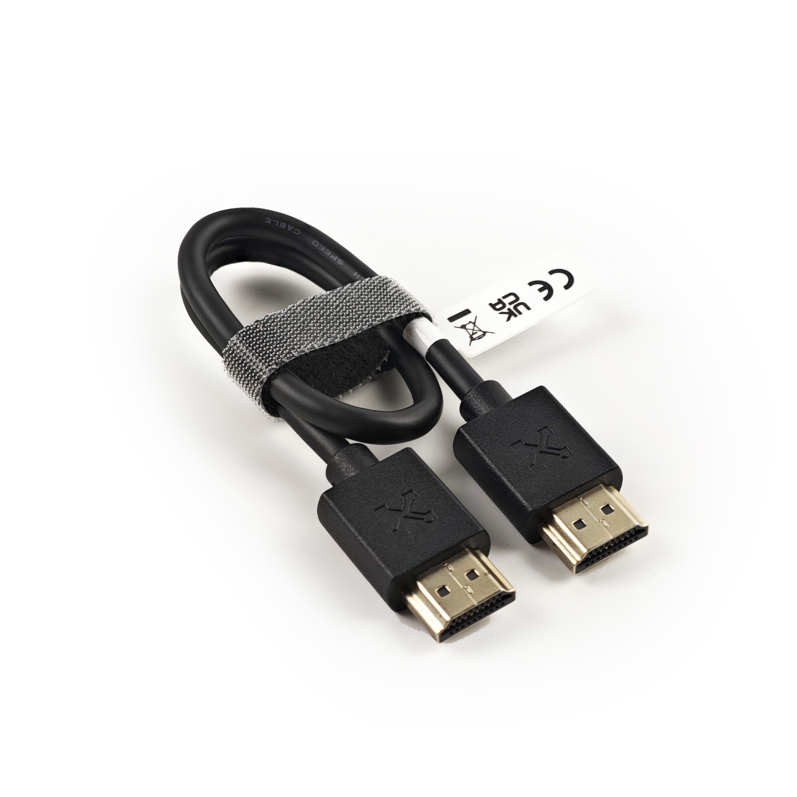

# アクセサリー

ここでは、Openterface Mini-KVMの機能を補完し、向上させるさまざまな製品をご紹介します。私たちは、Mini-KVMの使用体験をさらに多用途で便利にするためのアクセサリーを提供することを目指しています。

## VGA to HDMI コンバーターケーブル

{:style="height:360px"}

この製品は、VGAビデオをHDMIに変換し、オーディオを統合します。これにより、VGAデバイスをHDMIディスプレイに簡単に接続できます。

- **モデル**: CABLE100-VGA2HDMI
- **長さ**: 1メートル
- **出力ビデオ解像度**: 1920x1080P フルHD
- **入力オーディオ**: 3.5mmオーディオジャック
- **オーディオ出力**: HDMI経由
- **電源供給**: USB経由で給電

### 使用例
このケーブルの詳細な使用例については、[ストリームラインドサーバー管理](https://openterface.com/use-cases/#streamlined-server-management)をご覧ください。

### デモビデオ
Techインフルエンサーの**キャメロン・グレイ**による、このケーブルをMini-KVMと一緒に使用する方法のデモビデオをご覧ください: [このUSB KVMコンソールは素晴らしい！](https://youtu.be/xAEQpWyfY-c?si=auB5NtqHVw2C7iIK&t=1693)

<button class="md-button" onclick="window.location.href='https://www.crowdsupply.com/techxartisan/openterface-mini-kvm#products'">注文する</button>

---

## Type-C to USB-A ケーブルとアダプター

{:style="height:360px"}

この多用途なType-CオスからUSB-Aオスへのケーブルは、USB-AメスからUSB-Cオスへのアダプターと組み合わせて、ターゲットデバイスへの柔軟な接続を提供します。データ転送やキーボードとマウスの制御信号の伝送を、ターゲットデバイスがUSB-AポートまたはType-Cポートを使用しているかに関係なく可能にします。

- **長さ**: 0.3メートル
- **色**: ブラック
- **アダプター**: USB-AメスからUSB-Cオス
- **用途**: ターゲットデバイスへの簡単な制御とデータ転送を実現。

---

## Type-C to Type-C ケーブルとアダプター

{:style="height:360px"}

このスタイリッシュで柔らかい手触りのType-Cオスからオスへのケーブルは、鮮やかなオレンジ色で、ホストコンピュータ接続用に設計されています。USB-CメスからUSB-Aオスへのアダプターが付属しており、Type-CまたはUSB-Aポートを使用するホストコンピュータへの接続を確実にします。さらに、このケーブルは**240Wの急速充電**（電圧DC50V、電流5A、電力240W）をサポートしており、Mini-KVMだけでなく、携帯電話やノートパソコンの充電にも最適です。

- **長さ**: 1.5メートル
- **色**: オレンジ
- **アダプター**: USB-CメスからUSB-Aオス
- **用途**: ホストコンピュータとMini-KVM間の高速データ転送、および携帯電話やノートパソコンの急速充電に最適。

---

## HDMI オスからオスへのケーブル

{:style="height:360px"}

このコンパクトなHDMIケーブルは、ターゲットデバイスを接続してビデオ出力をキャプチャするのに最適で、Openterface Mini-KVMとのシームレスな統合を実現します。

- **長さ**: 0.3メートル
- **色**: ブラック
- **用途**: ターゲットデバイスからMini-KVMへの高解像度ビデオ伝送に最適。

---

## Openterface ツールキットバッグ

{:style="height:360px"}

このコンパクトなツールキットバッグで、Openterface Mini-KVMとそのアクセサリーを整理し、持ち運びやすくします。スタイリッシュなオレンジ色のジッパーと伸縮性のあるメッシュポケットが特徴で、優れたケーブル管理と持ち運びの容易さを提供し、ITプロフェッショナルに最適です。

- **寸法**: 180 x 115 x 50mm
- **色**: ブラックとオレンジのジッパー
- **用途**: Mini-KVMとそのケーブルを整理して保管するのに最適。

---

## エクステンションピンキャップ

{:style="height:360px"}

この3Dプリントされたエクステンションピンキャップは、Openterface Mini-KVMの元のキャップを置き換え、上級ユーザーが拡張ピンにアクセスしてカスタム開発を行えるようにします。3DモデルファイルはGitHubリポジトリからダウンロードして、自分でキャップを印刷できます。

- **用途**: 上級ハードウェア開発のための拡張ピンへのアクセスを提供。
- **ダウンロード**: [3Dモデルファイル](https://github.com/TechxArtisanStudio/Openterface_Mini-KVM_Hardware/tree/main/models)

---

## 近日公開予定

Openterface Mini-KVMの体験を向上させるために設計された、さらに多くのアクセサリーがこのセクションに追加される予定です。お楽しみに。