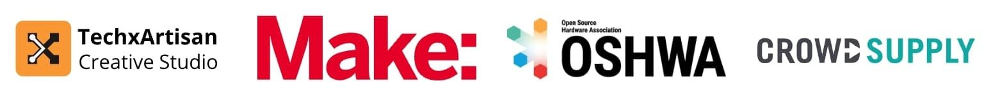

# 出荷完了！ツールキットに追加ケーブルも付属。次の展開は？

こんにちは、Openterfaceコミュニティの皆さん！

Openterface製品が正式に出荷されたことをお知らせします。現在、深圳の港に到着し、米国向けの貨物船への積載を待っています！

  

新しいお知らせはこちらです：

## 出荷準備：品質検査とパッキング

出荷・梱包の前に、全てのユニットを徹底的にテストし、最高の品質を確保しました。以前のアップデート（[DIYチャレンジ、素敵な賞品、そして生産は最終段階へ！](https://www.crowdsupply.com/techxartisan/openterface-mini-kvm/updates/diy-challenge-cool-prizes-and-production-nears-the-finish-line)）でもお伝えしたように、各ケーブルはMini-KVMを使用して信号伝送の安定性を検証済みです。

ここで、良いニュースと悪いニュースをお伝えします。

### 悪いニュース：一部のオレンジケーブルが厳しい条件下で期待に応えられず

Mini-KVMは、ビデオ、オーディオ、マウス/キーボード操作、USBデータを1本のType-Cケーブルで伝送します。ケーブルの性能は、特にデータの安定性において非常に重要です。

現実的な干渉をシミュレーションするため、オレンジのType-Cケーブルを電気ファンモーターに巻き付け、近くで複数のコンピュータを稼働させました。これにより、高いレベルの電磁干渉（EMI）が発生し、ケーブルのデータ伝送安定性を評価しました。

  
*低コストながら効果的なテスト方法です。*

比較用のテスト動画は[こちらのツイート](https://x.com/TechxArtisan/status/1856559677296816347)をご覧ください。

この条件下で、一部のオレンジケーブルは信号損失に苦しみ、データセンターや重要なIT業務中のような複雑な環境での信頼性に懸念が生じました。

これに対処するため、当社の技術ディレクターKevin Pengは専用のテストプログラムを開発しました。このツールは、USBケーブルの品質を自身でテストできるように設計されており、今後オープンソース化される予定です。

  
*プログラムを使用すれば、ケーブルのテストが簡単に行えます。*

オレンジケーブルは、柔らかいシリコンのような手触りと美しいデザインが魅力で、日常的な高速充電や通常のデータ伝送には最適ですが、厳しい条件下での高負荷なデータ伝送には不向きです。

### 良いニュース：解決策を用意しました！

すぐに高品質なナイロン製USB 3.2ケーブルを調達し、ツールキット版に**追加費用なしで**同梱することにしました。この耐久性に優れたケーブルは、*1m (3.2 ft)*、*1.5m (4.9 ft)*、*2m (6.5 ft)*の3つの長さがあり、ランダムに1本が同梱されます。Mini-KVMでの堅牢で信頼性の高い接続を確保します。

将来のMini-KVMツールキット版では、ホスト側接続用のオレンジケーブルをナイロンType-C 3.2ケーブルにアップグレードし、機能性、安定性、スタイルを兼ね備えたものにします。

この決定を喜んでいただけると幸いです。引き続き、テクノロジーの現場でOpenterfaceを信頼していただければと思います。

## 出荷スケジュール

Mini-KVMの到着予定は？  
出荷が順調に進めば、製品は12月中旬までにCrowd Supplyの**Mouser倉庫**に到着する予定です。その後、各注文に基づいてOpenterfaceが発送されます。

- **米国のバッカー向け**：クリスマス前の配達が可能な場合もありますが、ホリデーシーズンが近づくと物流が遅れる可能性があります。
- **米国外のバッカー向け**：配送時間は地域によって異なります。現在のところ、1月中旬を目標としています。

Openterface製品がスムーズに移動することを願っています——船酔いも車酔いも時差ボケもなしで！😃

## OpenterfaceのTシャツとフーディー

今週末（11月16日～17日）の深センメーカーフェアに参加します。準備の一環として、チーム用アパレルをデザインしました。Tシャツ、ジップアップ、プルオーバーフーディーをご用意しています。

デザインをご覧になり、ご意見をお聞かせください：  

## 開発支援のお願い

オープンソース開発をさらに支援したい方は、[TechxArtisan Shop](https://shop.techxartisan.com/)をご覧ください。ケーブル、Tシャツ、フーディーなどをご購入いただくことで、私たちのイノベーション活動を財政的に支援できます。すべての購入がオープンソースコミュニティの精神を支える力となります。

## 次の展開：ホストアプリのアップデート

出荷が始まった今、次のステップはホストアプリの改良です。さまざまなアプリストアでの認証を進めており、Openterfaceのご利用をスムーズにする準備を進めています。

## 次の展開：USB DIYコンテストに参加しよう！

Openterface Mini-KVMを受け取ったら、ぜひ**USB KVM DIYチャレンジ2024**に参加してみませんか？オープンソース開発に貢献し、特別版Mini-KVMを含む素晴らしい賞品をゲットするチャンスです！詳細は[Crowd Supplyのコンテストページ](https://www.crowdsupply.com/techxartisan/usb-kvm-diy-challenge-2024)をご覧ください。

  

## 最後に

これまでの旅を共にしてくださった皆様に感謝いたします。皆様のサポートとフィードバックが、私たちの前進を支えています。ご質問やアイデアがありましたら、ぜひお聞かせください！[Reddit](https://openterface.com/reddit)や[Discord](https://openterface.com/discord)のコミュニティでお待ちしています。

感謝を込めて、  
**Billy Wang**  
プロダクトマネージャー  
Openterfaceチーム | TechxArtisan
